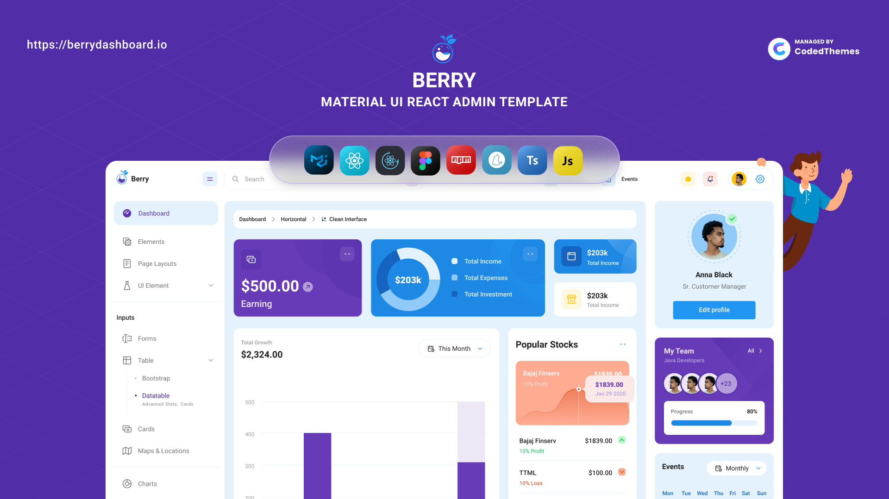

# Welcome

## ABOUT BERRY

[Berry](https://berrydashboard.io) is the most `developer-friendly` & highly customizable React Admin Template based on [Material-UI](http://material-ui.com/).

Berry comes with plenty of ready-to-use Material-UI components that will help you to build your site faster and saves your development time.

We’ve followed the best industry standards to make our product easy, fast & highly scalable to work with. It's made with this high-end technology stack - React Hooks, Components, Create React App & Redux.

## Technology Stack

* Material-UI v5 components library
* Authentication Methods - Auth0, Firebase, JWT
* React Hooks API
* Redux & React Context API for State Management
* React Router
* Axios
* Create React App
* Code Splitting
* CSS-in-JS
* Multi-Language

## Technology Stack

* [React Hooks \(17.0.2\)](https://reactjs.org/docs/hooks-intro.html)
* [Material UI v5](https://next.material-ui.com/)
* [Create React App](https://github.com/facebook/create-react-app)
* [Redux](https://redux.js.org/)
* [React Router](https://github.com/ReactTraining/react-router) 
* [Firebase](https://firebase.google.com/docs/auth), [Auth0](https://auth0.com/), [JWT](https://jwt.io/)
* [Google Fonts](https://fonts.google.com/)

## Any Suggestion? OR Feedback

Feedback from our beloved community is always welcome. Feel free to reach out anytime at our [Support Panel.](https://codedthemes.support-hub.io) We would love to hear from you anytime.

