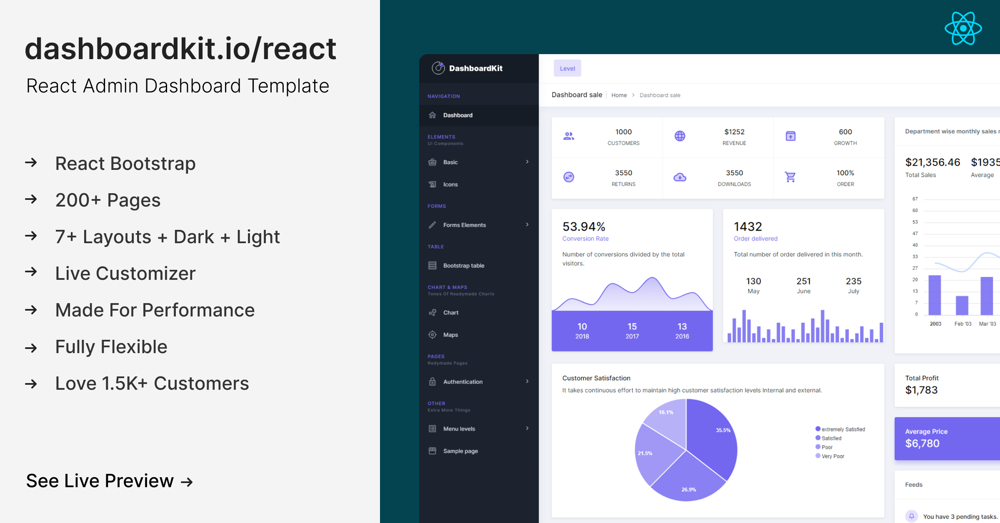

# Documentation

## About DashboardKit

[DashboardKit](https://dashboardkit.io) is the most `developer-friendly` & highly customizable React Admin Template based on React. It has everything you need for your backend projects.

DashboardKit comes with plenty of ready-to-use React Bootstrap components that will help you to build your site faster and save your development time.

We’ve followed the industry standards to make DashboardKit easy, fast, and highly scalable. DashboardKit is made with high-end technology stacks like - React Hooks, Components, Create React App, Redux & Redux-saga.

## Technology Stack

* React Bootstrap
* React Hooks API
* Redux & React Context API for State Management
* Redux Saga Middletier
* React Router
* Axios
* Create React App
* Code Splitting
* CSS-in-JS

## Credits

* [React Hooks (17.0.2)](https://reactjs.org/docs/hooks-intro.html)
* [Create React App](https://github.com/facebook/create-react-app)
* [Redux](https://redux.js.org)
* [React Router](https://github.com/ReactTraining/react-router)
* [Redux-Saga](https://redux-saga.js.org)
* [Firebase](https://firebase.google.com/docs/auth), [Auth0](https://auth0.com), [JWT](https://jwt.io)
* [Google Fonts](https://fonts.google.com)

## Any Suggestion? OR Feedback

Feedback from our beloved community is always welcome. Feel free to reach out anytime at our [Support Panel.](https://codedthemes.support-hub.io) We would love to hear from you anytime.
