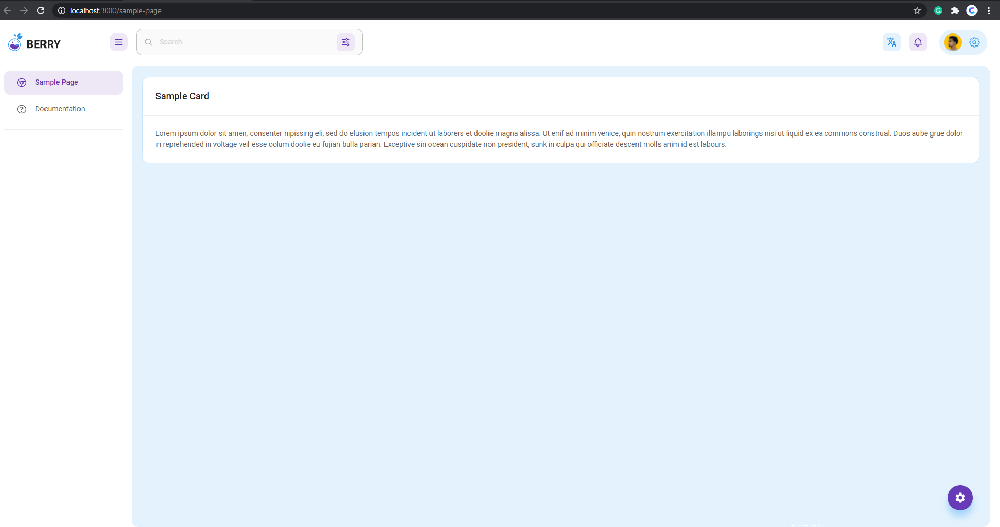
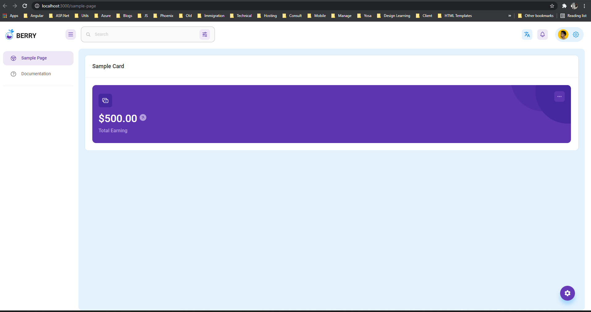

# Integration

With the years of experience and after crafted many themes, we come to know that, users often confuse with how to use all those components with most of the admin templates which they downloaded/purchased from the internet. If you ever downloaded admin themes, you might come across questions like, _**"how can I use this component in the project?", "How can I create a new project and set up theme/components?", "Can I have minimal code-base to start?"**_ etc. If you ever found yourself in such a situation, we came here to the rescue. 

Berry structured with a huge set of ready-to-use components. We tried to provide as many as possible components with customization so that you can integrate those directly into your projects. 

In this Integration article, we are going to explain, how can you create new a project with minimum setup and integrate some components as per your need. so let get' started.



> If you prefer reading docs, continue reading below instead watching video.

## Get started with Skeleton

If you have a purchased theme, it already comes with a skeleton structure, so that you can start directly from there. **Skeleton is a folder structure created using react-script with minimal files from the full version to get started**. It has all the dependencies preloaded in `package.json` so you do not need to add any additional dependency unless needed from your side. It has a sample page to get started; With that, Routes, menus, styles, configuration, and many other things have already set into that which saves ample no. of hours to set up a new project. Isn't it cool and time-savvy?


Skeleton version only available in purchased theme.


So when you run the project using yarn/npm, you will see a minimal site like below:



It provides you a very simple and intuitive structure to get started with a new project. You can add new components from the full version. Now let's see how can we do that.

### Add components into skeleton/new project

Now, let's add some cool components from the full version to the project which we just created. It will help you to craft your pages as per your need. So Let's begin:

Consider a scenario that you want to add `TotalEarning` widget \(Left card on default dashboard\) from the full version default dashboard to the sample page. For that, we need to do the following things in order.

1. Remove content inside `<MainCard>` from sample-page/index.js.
2. Copy file `src/views/dashboard/Default/EarningCard.js` to `Sample` folder. **Resolves path and asset dependencies by copying missing assets from the full version.**
3. You will have the following final version of `sample/index.js`

```javascript
const SamplePage = () => {
    return (
        <MainCard title="Sample Card">
            <EarningCard></EarningCard>
        </MainCard>
    );
};

export default SamplePage;
```

The output of this will be following:



Not looked pretty right, that is because the card is spread around all 12 columns, we need to limit it to specific columns. Change code as follows by adding [material-ui grid system](https://material-ui.com/components/grid/#grid):

```javascript
const SamplePage = () => {
    return (
        <MainCard title="Sample Card">
            <Grid container>
                <Grid item xs={3}>
                    <EarningCard></EarningCard>
                </Grid>
            </Grid>
        </MainCard>
    );
};

export default SamplePage;
```

It will output as following:


Cool and straightforward, right? 

You can do the same for other components and design your pages as per your needs. We have made common and reusable controls as well which you can see inside `/src/ui-component`. Feel free to refer to those as well and start developing your page.

I hope, we cover some basics to get started with Berry template and how to integrate for your new project. 

